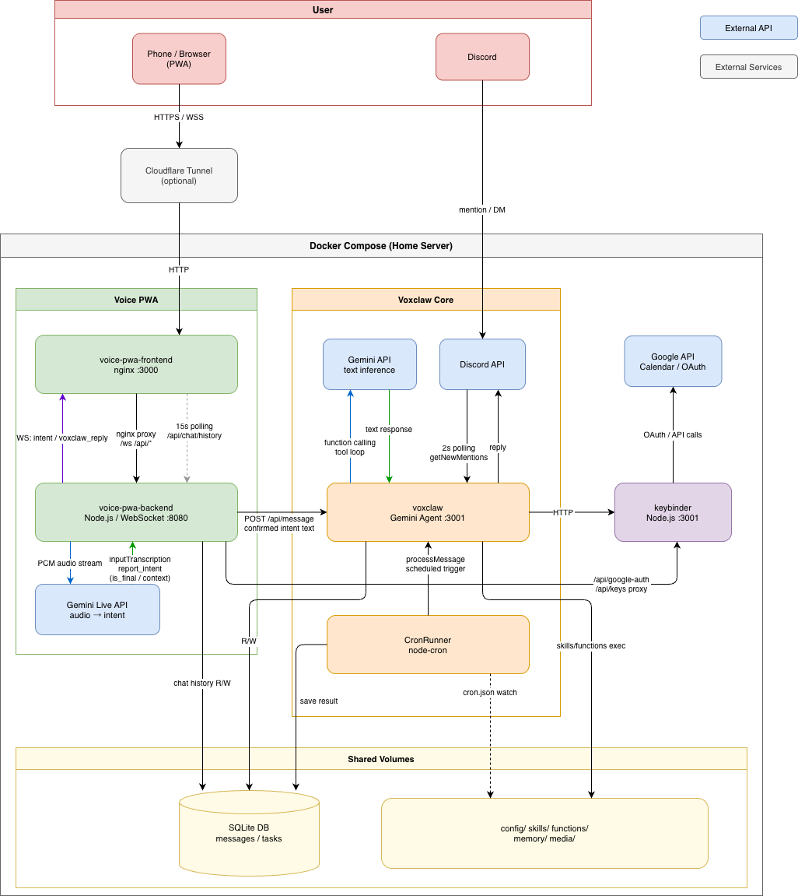

# Voxclaw 🐾

🇺🇸 English | [🇯🇵 日本語](README.ja.md)

**A voice-first AI assistant PWA with real-time intent estimation.**
Speak naturally — Gemini infers your intent and fills the input box. Review, edit if needed, then execute. All in your browser.

---

## How It Works

```
[Mic] ──► audio stream ──► Gemini Live API ──► intent text (editable)
                                                       │
                                              [User reviews / edits]
                                                       │
                                                   [Send] ──► skill execution ──► reply
```

1. **Speak** — tap the mic and talk naturally
2. **Review** — Gemini infers your intent and fills the text box in real time
3. **Edit** — refine the inferred text if needed
4. **Execute** — press send; voxclaw runs the appropriate skill and replies

The editable intent step is the core differentiator: you stay in control of what the AI actually does.

---

## Key Features

| Feature | Description |
|---|---|
| **Real-time intent estimation** | Voice is streamed to Gemini Live API; inferred intent appears as editable text before execution |
| **Dynamic skills** | Drop a JS file into `skills/` — active immediately, no rebuild needed |
| **Cron scheduling** | Schedule skills to run automatically via the in-app Cron tab |
| **Key Binder** | API keys isolated in a separate container; the skill engine never holds credentials directly |
| **PWA** | Installable on mobile/desktop; UI shell works offline |
| **JWT auth** | Password-protected single-user access with 7-day sessions |

---

## Tabs

| Tab | Description |
|---|---|
| **Chat** | Main interface — voice or text input, skill results displayed here |
| **Skills** | Browse all available skills and their descriptions |
| **Cron** | Configure scheduled skill execution (time, days, destination) |
| **Task** | Manage local tasks — add, complete, edit, set due dates; voice input supported |
| **Settings** | Manage API keys (Brave Search, Mapbox) and Google auth |

---

## Quickstart

```bash
# 1. Clone
git clone https://github.com/Nishina-N/voxclaw
cd voxclaw

# 2. Set environment variables
cp .env.example .env
# Fill in: GEMINI_API_KEY, PWA_PASSWORD, JWT_SECRET

# 3. Configure API keys for skills (optional)
cp keybinder/secrets_for_skills.example.json keybinder/secrets_for_skills.json
# Add keys for Brave Search, Mapbox, Google, etc. as needed

# 4. Start
docker-compose up -d --build

# 5. Open
# Visit http://localhost:8080 and log in with your PWA_PASSWORD
```

---

## Architecture

See **[docs/architecture.en.md](docs/architecture.en.md)** for a full breakdown of components and data flow.



```
Browser (PWA)  ─────────────────────────────────────────────────────────
  voice-pwa-frontend   nginx :3000       static PWA, proxies /ws /api/*
  voice-pwa-backend    Node.js :8080     Gemini Live ↔ intent WebSocket
                                         confirmed intent → voxclaw core

voxclaw core ───────────────────────────────────────────────────────────
  voxclaw              Gemini Agent      skill execution, agent loop
  keybinder            key isolation     external API proxy (:3001)
  CronRunner           node-cron         scheduled skill execution

Shared volumes ─────────────────────────────────────────────────────────
  SQLite DB            messages / tasks
  functions/           dynamic skills (hot-reloadable)
  skills/              skill combination manuals
  config/              cron.json, channels.json
```

---

## Docs

| Document | Description |
|---|---|
| [docs/setup.en.md](docs/setup.en.md) | Installation guide (PWA-first; Discord and Google are optional) |
| [docs/architecture.en.md](docs/architecture.en.md) | System architecture and data flow |
| [docs/skills.en.md](docs/skills.en.md) | Skill interface, built-in tools, Key Binder API reference |

---

## License

Released under the [MIT License](LICENSE).

> ⚠️ **Patent pending (2026):** The voice → intent estimation → user review/editing → execution pipeline is the subject of a patent application in Japan.
