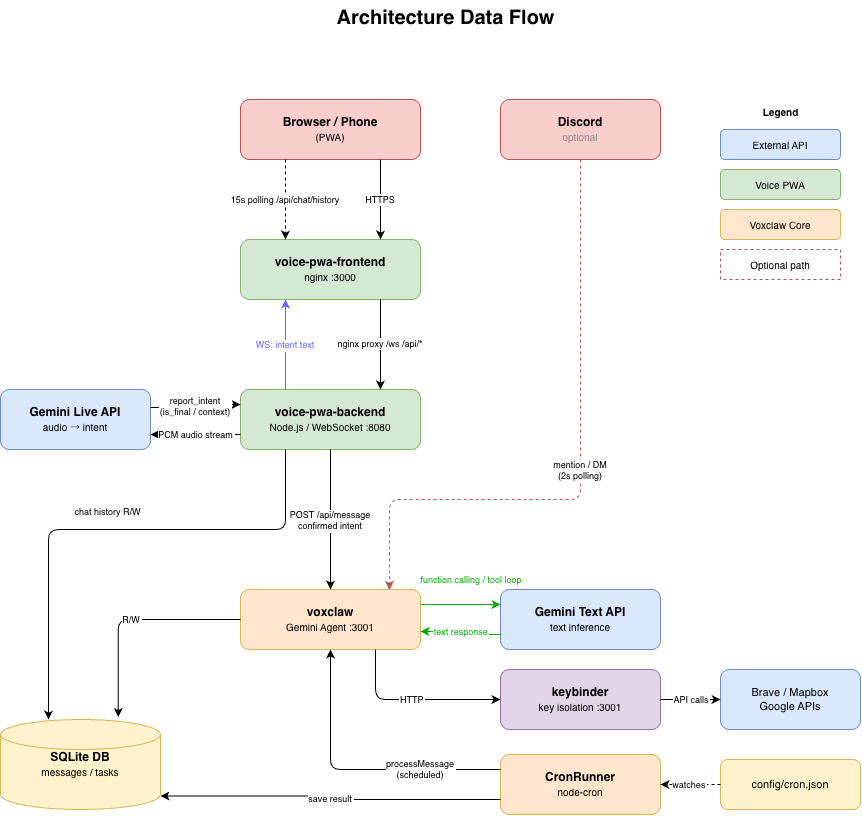

# Architecture

[🇯🇵 日本語](architecture.md) | [← Back to README](../README.md)

## Table of Contents

1. [Design Philosophy](#1-design-philosophy)
2. [Component Overview](#2-component-overview)
3. [Data Flow](#3-data-flow)
4. [Directory Structure](#4-directory-structure)
5. [Mutable vs. Immutable](#5-mutable-vs-immutable)

---

## 1. Design Philosophy

Voxclaw is built around three principles.

**Lightweight** — No dependency on external orchestration services. All you need is Docker and a Gemini API key.

**Secure** — Because the agent can write its own skill scripts, direct access to API keys is prohibited. The keybinder container holds all credentials; the agent only receives results.

**Human-readable code** — Skills are saved as `run.sh` (or `.py`) files that humans can inspect and modify. The agent's core logic is sealed in the container image; config, skills, and manuals live as readable files outside.

---

## 2. Component Overview


```
┌──────────────── Docker Compose (home server) ──────────────────────────────┐
│                                                                             │
│  ┌─────────── Voice PWA ───────────┐  ┌──────── Voxclaw Core ───────────┐  │
│  │                                 │  │                                  │  │
│  │  voice-pwa-frontend  :3000      │  │  voxclaw (Gemini Agent)  :3001   │  │
│  │  voice-pwa-backend   :8080      │  │  CronRunner (node-cron)          │  │
│  │  [Gemini Live API]              │  │  keybinder               :3001   │  │
│  │                                 │  │  [Gemini API / Discord API]      │  │
│  └─────────────────────────────────┘  └──────────────────────────────────┘  │
│                                                                             │
│  ┌─────────────────────── Shared Volumes ─────────────────────────────────┐ │
│  │  SQLite DB (messages / tasks)    config/ functions/ skills/ media/    │ │
│  └────────────────────────────────────────────────────────────────────────┘ │
└─────────────────────────────────────────────────────────────────────────────┘
```

### voice-pwa-frontend (nginx :3000)

An nginx container serving static files. Provides the PWA's HTML/CSS/JS and proxies WebSocket (/ws) and API (/api/*) requests to voice-pwa-backend.

### voice-pwa-backend (Node.js / WebSocket :8080)

- Receives PCM audio streams from the browser and forwards them to the Gemini Live API
- Returns inferred intent text (`report_intent`) to the browser via WebSocket
- Forwards confirmed intent to the voxclaw core via `POST /api/message`
- Reads/writes chat history and tasks to SQLite
- Proxies `/api/google-auth` and `/api/keys` requests to keybinder

### voxclaw (Gemini Agent :3001)

- Agent loop using Gemini text API (up to 20 rounds)
- Dynamically loads skills from `functions/` and invokes them via function calling
- Polls Discord channels every 2 seconds for mentions/DMs (optional)
- Accepts scheduled execution from CronRunner

### keybinder (Node.js :3001)

- Proxy server for external APIs (Brave Search, Mapbox, Google APIs)
- Mounts `keybinder/secrets/` to this container only — the voxclaw container cannot read the keys
- Adding a new external API requires a human to add an endpoint to `keybinder/server.ts` and rebuild (an intentional security constraint)

### CronRunner (node-cron)

- Fires scheduled prompts to voxclaw according to `config/cron.json`
- Runs as an internal module of the voxclaw core

### Gemini Live API (external)

- External API that voice-pwa-backend connects to via WebSocket streaming
- Real-time PCM audio → intent text estimation (`report_intent` function calling)

---

## 3. Data Flow


### Voice Input (primary flow)




### Discord (optional)

```
[Discord]  ── mention/DM ──►  [voxclaw :3001]  ──►  skill execution  ──►  reply
                            2-second polling
```

### Cron (scheduled execution)

```
[cron.json]  ──►  [CronRunner]  ──►  processMessage  ──►  [voxclaw]  ──►  save result
```

---

## 4. Directory Structure

```
voxclaw/
├── src/                      # ❌ Immutable (baked into container image)
│   ├── index.ts              # Entry point, polling loop
│   ├── db.ts                 # SQLite layer
│   ├── agent.ts              # Gemini API, agent loop
│   └── cron-runner.ts        # Cron scheduler
│
├── voice-pwa/                # ❌ Immutable (baked into container image)
│   ├── frontend/             # nginx + static PWA (HTML/CSS/JS)
│   └── backend/              # Node.js WebSocket server, Gemini Live connection
│
├── keybinder/                # 🔑 API key isolation container
│   ├── server.ts             # API proxy server (:3001)
│   └── secrets/              # API key storage — gitignored
│       ├── keys.json         # Brave / Mapbox keys
│       └── client_secret.json  # Google OAuth — place manually
│
├── functions/                # ✅ Mutable (agent and human read/write)
│   └── <skill-name>/
│       ├── definition.json   # Gemini FunctionDeclaration
│       └── run.sh            # Execution script (bash / Python / Node.js)
│
├── skills/                   # ✅ Mutable (skill combination manuals)
│   └── <task>_recipe.md
│
├── config/                   # ✅ Mutable
│   ├── cron.json             # Scheduled task definitions
│   └── channels.json         # Discord channel config (optional)
│
├── memory/                   # ✅ Mutable (SQLite DB, daily memos)
├── media/                    # ✅ Mutable (images generated by skills)
├── workspace/                # ✅ Mutable (agent work output)
├── knowledge/                # 📖 Read-only (reference documents)
│
├── prompts/
│   ├── AGENTS.md             # Behavior rules — read-only
│   ├── TOOLS.md              # Tool specs — read-only
│   ├── SOUL.md               # Character/tone ✅ agent-writable
│   ├── USER.md               # User info ✅ agent-writable
│   └── IDENTITY.md           # Name/profile ✅ agent-writable
│
├── Dockerfile
├── docker-compose.yml
└── .env
```

---

## 5. Mutable vs. Immutable

| Area | Write access | Description |
|---|---|---|
| `src/` | ❌ None | Agent loop, connections, tool engine (in container image) |
| `voice-pwa/` | ❌ None | PWA frontend and backend (in container image) |
| `prompts/AGENTS.md`, `TOOLS.md` | Human only | System rules (read-only mount) |
| `functions/` | ✅ Agent + human | Dynamic skills |
| `skills/` | ✅ Agent + human | Skill combination manuals |
| `config/` | ✅ Agent + human | Cron and channel config |
| `prompts/SOUL.md` etc. | ✅ Agent + human | Personality, user info |
| `memory/` | ✅ Agent | Daily memos, SQLite DB |
| `media/` | ✅ Agent | Generated images etc. |
| `keybinder/secrets/` | Human only | API keys, OAuth secrets |

This separation keeps the core logic stable as a container image, while user configuration, skills, and data are persisted via volume mounts.
