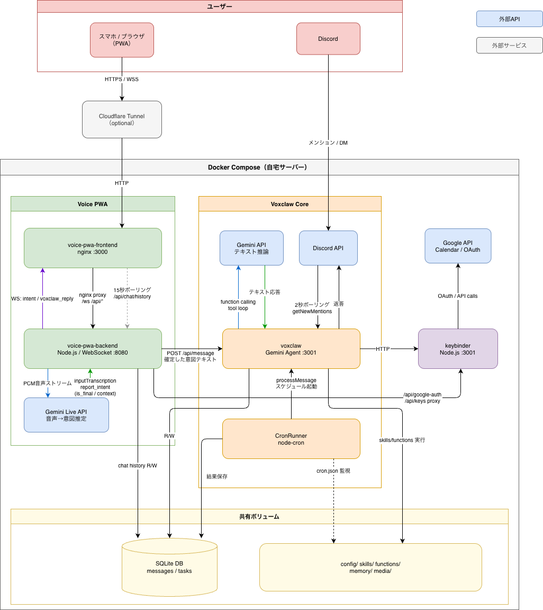

# アーキテクチャ

[🇺🇸 English](architecture.en.md) | [← README に戻る](../README.ja.md)

## 目次

1. [設計思想](#1-設計思想)
2. [コンポーネント概要](#2-コンポーネント概要)
3. [データフロー](#3-データフロー)
4. [ディレクトリ構成](#4-ディレクトリ構成)
5. [可変部 vs 非可変部](#5-可変部-vs-非可変部)

---

## 1. 設計思想

Voxclaw は3つの原則で設計されています。

**軽量** — 外部サービスに依存せず、Docker と Gemini API があれば動く。追加のオーケストレーションレイヤーは不要。

**セキュア** — エージェントがスキルスクリプトを自作できる設計上、APIキーへの直接アクセスは禁止。keybinder コンテナがキーを隔離し、エージェントは結果だけを受け取る。

**人が読めるコード** — スキルは `run.sh`（または `.py`）として保存され、人間が確認・修正できる。エージェントのロジックはコンテナに封じ込め、設定・スキル・マニュアルは人間も読み書きできるファイルとして外部に置く。

---

## 2. コンポーネント概要



```
┌──────────────────── Docker Compose（自宅サーバー）────────────────────────┐
│                                                                            │
│  ┌─────────── Voice PWA ───────────┐  ┌──────── Voxclaw Core ──────────┐  │
│  │                                 │  │                                 │  │
│  │  voice-pwa-frontend  :3000      │  │  voxclaw（Gemini Agent）:3001   │  │
│  │  voice-pwa-backend   :8080      │  │  CronRunner（node-cron）        │  │
│  │  [Gemini Live API]              │  │  keybinder               :3001  │  │
│  │                                 │  │  [Gemini API / Discord API]     │  │
│  └─────────────────────────────────┘  └─────────────────────────────────┘  │
│                                                                            │
│  ┌────────────────────── 共有ボリューム ──────────────────────────────────┐ │
│  │  SQLite DB（messages / tasks）   config/ functions/ skills/ media/   │ │
│  └───────────────────────────────────────────────────────────────────────┘ │
└────────────────────────────────────────────────────────────────────────────┘
```

### voice-pwa-frontend（nginx :3000）

静的ファイルを配信する nginx コンテナ。PWA の HTML / CSS / JS を提供し、WebSocket (/ws) と API (/api/*) を voice-pwa-backend にプロキシする。

### voice-pwa-backend（Node.js / WebSocket :8080）

- ブラウザからの PCM 音声ストリームを受け取り、Gemini Live API に転送
- Gemini が推定した意図テキスト（`report_intent`）をブラウザへ返送（WebSocket）
- ユーザーが確定した意図を `POST /api/message` で voxclaw コアへ転送
- チャット履歴・タスクを SQLite に読み書き
- keybinder への `/api/google-auth`, `/api/keys` リクエストをプロキシ

### voxclaw（Gemini Agent :3001）

- Gemini テキスト API を使ったエージェントループ（最大20ラウンド）
- スキル（`functions/`）を動的ロードし、function calling でツールを呼び出す
- Discord チャンネルを2秒ポーリングしてメンション/DM を処理（オプション）
- CronRunner からスケジュール起動を受け付ける

### keybinder（Node.js :3001）

- 外部 API（Brave Search・Mapbox・Google APIs）へのプロキシサーバー
- `keybinder/secrets/` をこのコンテナにのみマウント — voxclaw からキーは見えない
- 新しい外部 API を使うには、人間が `keybinder/server.ts` にエンドポイントを追加してリビルドする（意図的な制約）

### CronRunner（node-cron）

- `config/cron.json` の定義に従い、スケジュールされたプロンプトを voxclaw に投げる
- voxclaw コアの内部モジュールとして動作

### Gemini Live API（外部）

- voice-pwa-backend が WebSocket でストリーミング接続する外部 API
- PCM 音声 → 意図テキストのリアルタイム推定（`report_intent` function calling）

---

## 3. データフロー

### 音声入力（主フロー）

```
[スマホ/ブラウザ]
  │ マイク音声（PCM ストリーム）
  ▼
[voice-pwa-frontend]  ── nginx proxy ──►  [voice-pwa-backend :8080]
                                                   │
                          ◄── WS: intent ──────────┤  PCM ──► [Gemini Live API]
                                                   │◄── report_intent (is_final/context)
                          確定した意図テキスト          │
                                               POST /api/message
                                                   │
                                                   ▼
                                           [voxclaw :3001]
                                                   │
                                     ┌─────────────┤
                                     │ function calling
                                     ▼             │
                              [Gemini Text API]    ├─► [keybinder] ──► 外部API
                                     │             │
                                     └─► テキスト応答 ──► SQLite → ブラウザへポーリング
```

### Discord（オプション）

```
[Discord]  ── メンション/DM ──►  [voxclaw :3001]  ──►  スキル実行  ──►  返答
                               2秒ポーリング
```

### Cron（定時実行）

```
[cron.json]  ──► [CronRunner]  ──► processMessage  ──►  [voxclaw]  ──►  結果保存
```

---

## 4. ディレクトリ構成

```
voxclaw/
├── src/                      # ❌ 非可変（コンテナに焼き込み）
│   ├── index.ts              # エントリーポイント・ポーリングループ
│   ├── db.ts                 # SQLite 層
│   ├── agent.ts              # Gemini API・エージェントループ
│   └── cron-runner.ts        # cron スケジューラ
│
├── voice-pwa/                # ❌ 非可変（コンテナに焼き込み）
│   ├── frontend/             # nginx + 静的 PWA（HTML/CSS/JS）
│   └── backend/              # Node.js WebSocket サーバー・Gemini Live 接続
│
├── keybinder/                # 🔑 APIキー隔離コンテナ
│   ├── server.ts             # APIプロキシサーバー（:3001）
│   └── secrets/              # APIキー置き場 ※gitignore
│       ├── keys.json         # Brave / Mapbox キー
│       └── client_secret.json  # Google OAuth ※手動配置
│
├── functions/                # ✅ 可変（エージェント・人間が読み書き可）
│   └── <skill-name>/
│       ├── definition.json   # Gemini FunctionDeclaration
│       └── run.sh            # 実行スクリプト（bash / Python / Node.js）
│
├── skills/                   # ✅ 可変（スキルの組み合わせ手順書）
│   └── <task>_recipe.md
│
├── config/                   # ✅ 可変
│   ├── cron.json             # 定期タスク定義
│   └── channels.json         # Discord チャンネル設定（オプション）
│
├── memory/                   # ✅ 可変（SQLite DB・日次メモ）
├── media/                    # ✅ 可変（スキルが生成した画像等）
├── workspace/                # ✅ 可変（エージェントの作業出力）
├── knowledge/                # 📖 読み取り専用（参照ドキュメント）
│
├── prompts/
│   ├── AGENTS.md             # 行動ルール ※読み取り専用
│   ├── TOOLS.md              # ツール仕様 ※読み取り専用
│   ├── SOUL.md               # キャラクター・口調 ✅ エージェントが書き換え可
│   ├── USER.md               # ユーザー情報 ✅ エージェントが書き換え可
│   └── IDENTITY.md           # 名前・プロフィール ✅ エージェントが書き換え可
│
├── Dockerfile
├── docker-compose.yml
└── .env
```

---

## 5. 可変部 vs 非可変部

| 領域 | 書き込み権限 | 説明 |
|---|---|---|
| `src/` | ❌ なし | エージェントループ・接続・ツールエンジン（コンテナに焼き込み） |
| `voice-pwa/` | ❌ なし | PWA フロントエンド・バックエンド（コンテナに焼き込み） |
| `prompts/AGENTS.md`, `TOOLS.md` | 人間のみ | システムルール（読み取り専用マウント） |
| `functions/` | ✅ エージェント・人間 | 動的スキル |
| `skills/` | ✅ エージェント・人間 | スキルの組み合わせ手順書 |
| `config/` | ✅ エージェント・人間 | cron・チャンネル設定 |
| `prompts/SOUL.md` 等 | ✅ エージェント・人間 | 人格・ユーザー情報 |
| `memory/` | ✅ エージェント | 日次メモ・SQLite DB |
| `media/` | ✅ エージェント | 生成画像等 |
| `keybinder/secrets/` | 人間のみ | APIキー・OAuth シークレット |

この分離により、コアロジックはコンテナイメージとして安定し、ユーザーの設定・スキル・データはボリュームマウントで永続化されます。
